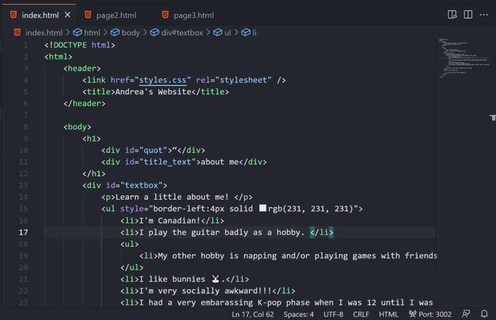
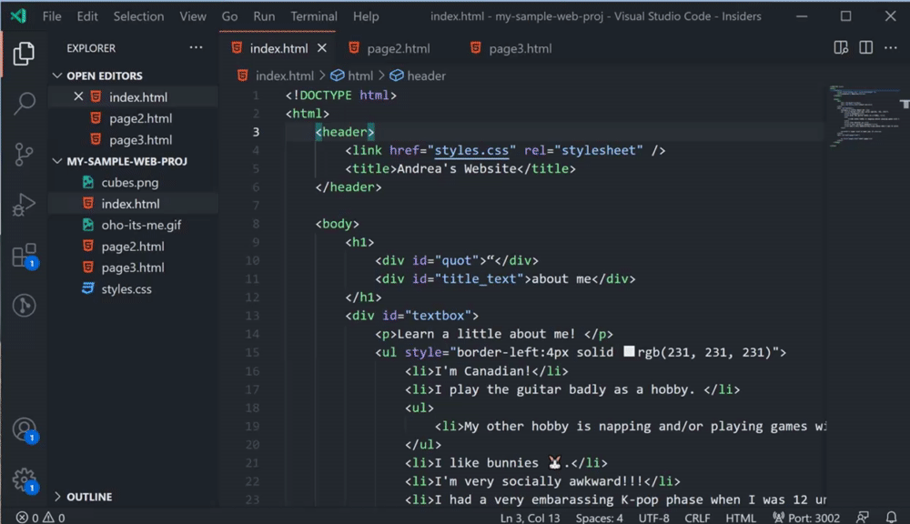
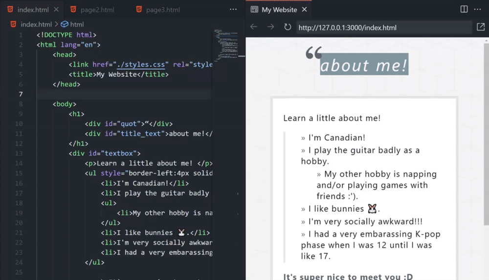
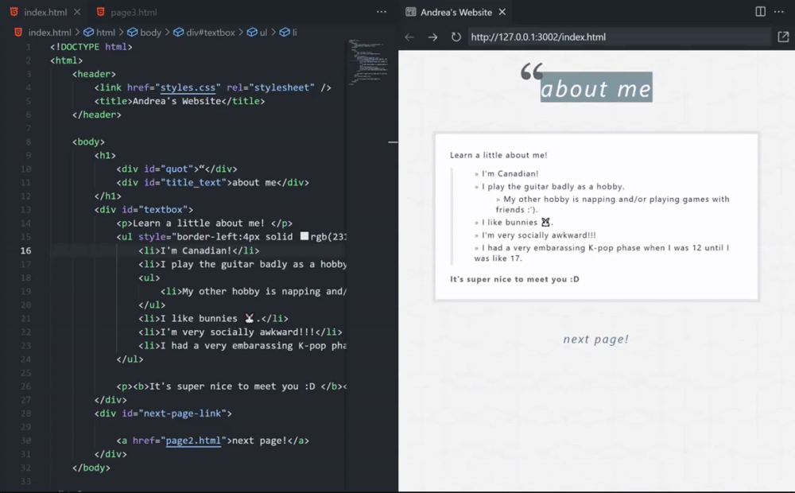
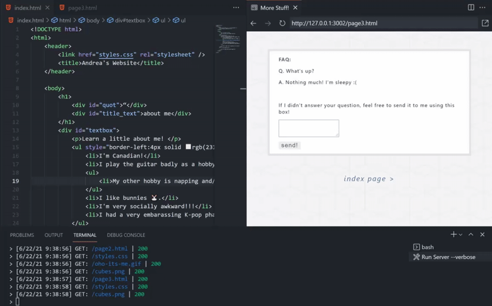
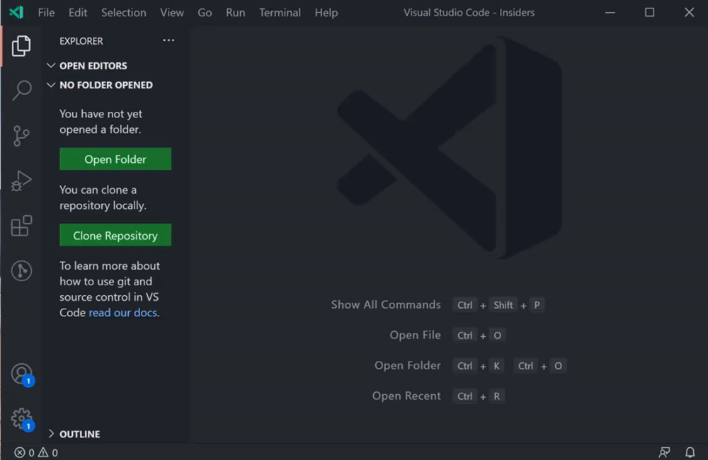

# Live Preview - VS Code Extension 📡

⚠️ WARNING: this extension is still under initial development! Use at your own risk. ⚠️

An extension that hosts a local server for you to preview your web projects on!

## Table of Contents
- [Features](#features)
- [Prerequisites](#prerequisites)
- [Running the Extension](#running-the-extension)
- [FAQ](#faq)
- [Issue Tracking](#issue-tracking)

## Features
### HTML File Previewing
Preview your HTML files quickly by clicking the preview button in the top right corner of your editor or using the context menu.

### Embedded Preview
A preview is available in-editor for the files hosted by the server. The simple embedded browser features history tracking, a url bar, and a button to open the preview externally. 

### Live Refreshing
See the changes as you make them. By default, changes appear as you make them in the editor. You can also change this in settings to refresh the preview on save or not at all. 

### Persistent Server Task with Server Logging
If you're looking for a persistent server to run, you can run a `Live Preview` task, which can optionally log the server traffic. You can also click on the traffic to open the file location of the file returned by the server.

## External Browser Previewing
Although all of the images above use the embedded browser, you can also experience the same features in an external browser.

You can edit the preview target in the extension settings.

### Workspace-less Previewing
No workspace? No problem! For a quick preview of your file, the server can also access files outside of your workspace to preview. 

Notes about workspace-less extension use:
- Linked files for these pages may not be correct if they are relative to a specific root (e.g. a project root). 
- Tasks do not work outside of a workspace, so a server will just launch in the background upon external preview when outside of a workspace. You can use the `Live Preview: Force Stop Server` command to kill the server in this case.

### Multi-root Support
When using a multi-root workspace, use `Live Preview: Select Default Workspace for Server` to select a default workspace for the server root. The selection will be saved in your workspace setting. Alternatively, you can also directly assign a path to the `LivePreview.serverWorkspace` setting.

## Prerequisites
To use this extension, you must have [Node JS v14+](https://nodejs.org/en/download/). 
## Running the extension
### Download from the Marketplace
You can install the extension [in the marketplace here](https://marketplace.visualstudio.com/items?itemName=ms-vscode.live-server)!
### Manually Compiling and Running
- Open this example in VS Code 1.56+
- `npm install`
- `npm run compile`
- <kbd>F5</kbd> to start debugging

## FAQ
Q. What does the `"Previewing a file that is not a child of the server root. To see fully correct relative file links, please open a workspace at the project root."` message mean?

A. Either:
- You have no workspace open and opened a preview.
- You opened a preview for a file that is not normally part of your workspace.
- You are in a multi-root workspace and opened a file that is not a child of your selected default server workspace (or have not reloaded the window after changing your setting).

Why does this happen? 

The server is hosted from the root of the workspace that the user opens (or in a multi-root case, the selected default workspace). Files outside of this can be previewed, but some file paths (such as a link to the root) may not go to the right place. **If you are working on a web project, it is advised that you open a workspace at the root of the project.**

## Issue Tracking
- [May Iteration](https://github.com/microsoft/vscode/issues/124607)
- [June Iteration](https://github.com/microsoft/vscode/issues/124608)
- [Backlog](https://github.com/microsoft/vscode/issues/125343)
- [Misc Issues](https://github.com/microsoft/vscode/issues?q=is%3Aopen+is%3Aissue+label%3Alive-server)
