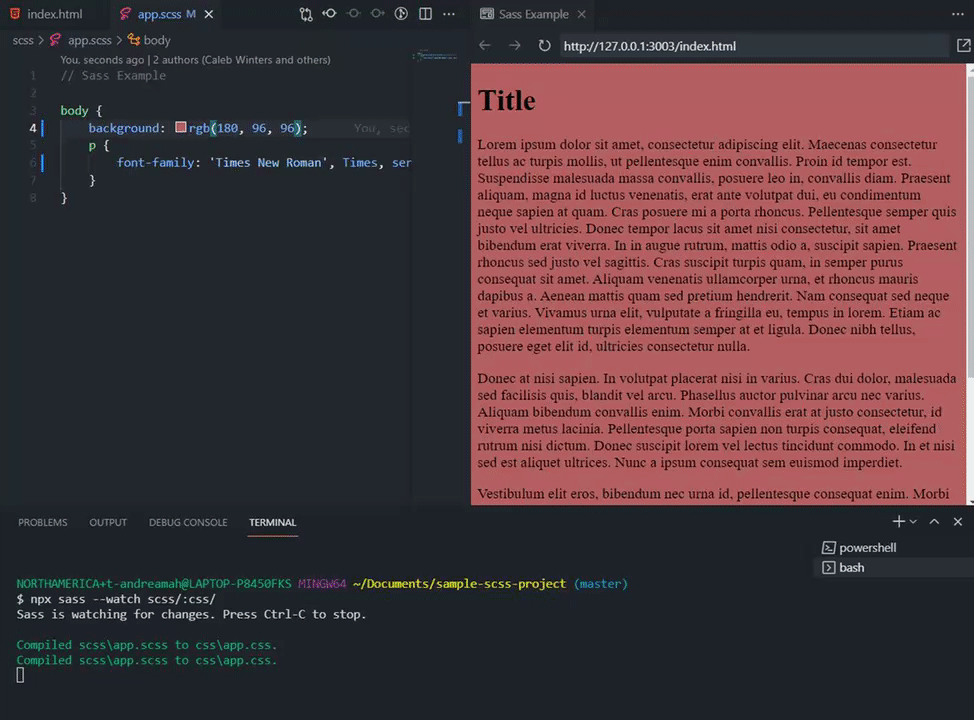
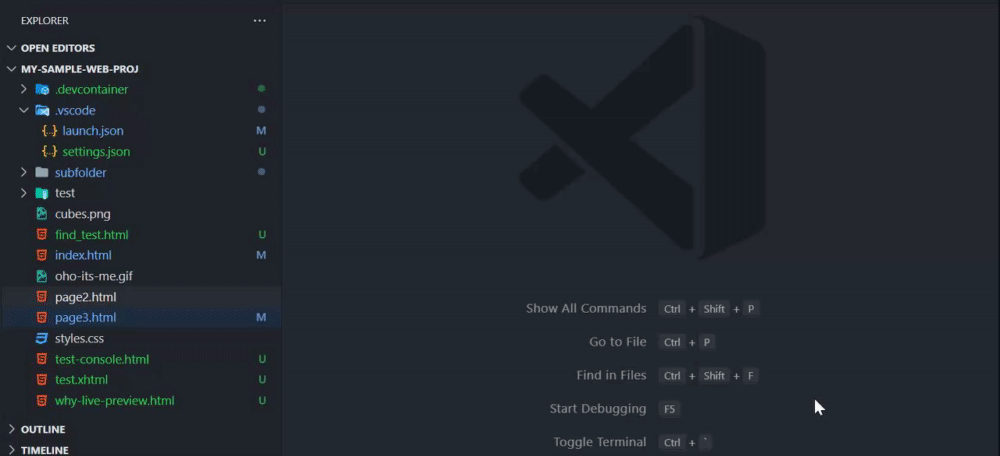

# July 2021 Release Notes - VS Code Live Preview 🔎💻

Welcome to another iteration's release notes! To get the latest stable version, download it from the marketplace [here](https://marketplace.visualstudio.com/items?itemName=ms-vscode.live-server). 😀

Here's a small summary on what features we introduced this month. 

## Improved Embedded Browser Options
The `Open in Browser` button is now replaced with a `More` button that opens a menu. It includes the following:
- `Open in Browser`: open the current page in the browser
   - can be configured to run with the debugger attached by setting `livePreview.debugOnExternalPreview: true`.
- `Find in Page`: Searching for text in a page.
- `Open Devtools Pane`: Opens the Webview DevTools pane. 

## External Preview Debugging
The external preview now supports JavaScript debugging using the build-in debugger. Set breakpoints and use the [Edge Tools Extension](https://marketplace.visualstudio.com/items?itemName=ms-edgedevtools.vscode-edge-devtools) to inspect elements in its build-in DevTools pane.

## Support for Watch Script Refreshing
When using a watch script to auto-generate files for your project, the preview will now refresh with you! Set `"livePreview.autoRefreshPreview": "On Changes to Saved Files"` to get the best performance out of this feature.

Here is the extension used with SCSS:

## Server Start Command and Default Start File
There is now a `Live Preview: Start Server` command that can be accessed regardless of what you have open in your workspace. This will start the server and open a preview at index or at a specified page. To specify a default file to open when using this command, right-click the file in the workspace's file explorer and select `Live Preview: Open Automatically on Server Start` from the context menu.

Here's an example with `page3.html` set as the default file to show:

## Basic Console for Embedded Preview
There is now an output channel to show the console logging results. It will show the output from many of the `console` printing functions. 

To use it, go to the `Output` tab and select `Embedded Live Preview Console` in the dropdown.

---
For a more detailed list of changes, see the project's [changelog](https://github.com/microsoft/vscode-livepreview/blob/main/CHANGELOG.md). 

Thanks for reading and stay tuned for more updates! 😄🚀🔨