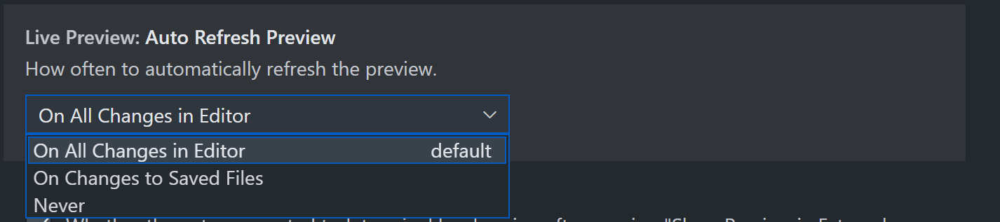
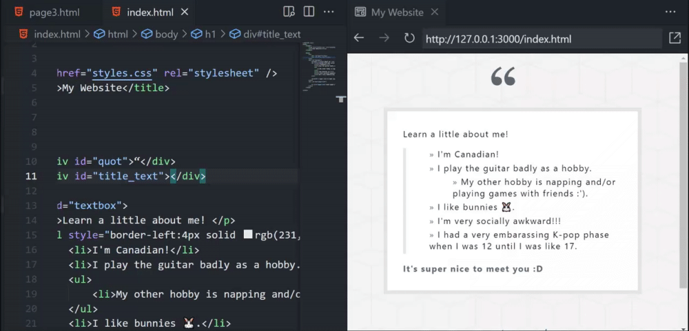

# June 2021 Release Notes - VS Code Live Preview 🚀💻

Welcome back to the release notes for Live Preview! Download it from the marketplace [here](https://marketplace.visualstudio.com/items?itemName=ms-vscode.live-server). Many of these features are already documented in the current README.

## New Features:
### Improved Embedded Preview UI
#### Navigation Bar
Features a new URL bar and the pre-existing navigation and refresh buttons!

#### Link Preview
Browser-like link preview has also been added when hovering links.

### Live Preview Task for Persistent Server
Tasks have been added for those who want a persistent server running. It also allows you to look at the files that are being served via the server log and its associated terminal links!

### Multi-root Support
When in a multi-root workspace, the extension will ask you which workspace to use for the server root. The other workspaces can still be previewed, although they will be treated as a out-of-workspace file. Upon changing workspaces, the embedded preview will auto-redirect if necessary.

### Out-of-workspace Preview
You can now even preview outside of a workspace! The server will simply create a custom endpoint for your new server root if necessary.

### Options for Preview Refresh
If you prefer to have less preview refreshes during editing, feel free to configure the extension to only refresh on file save.

Here's editing with the 'on save' option!

Thanks for reading and stay tuned for more updates. 😀🔧