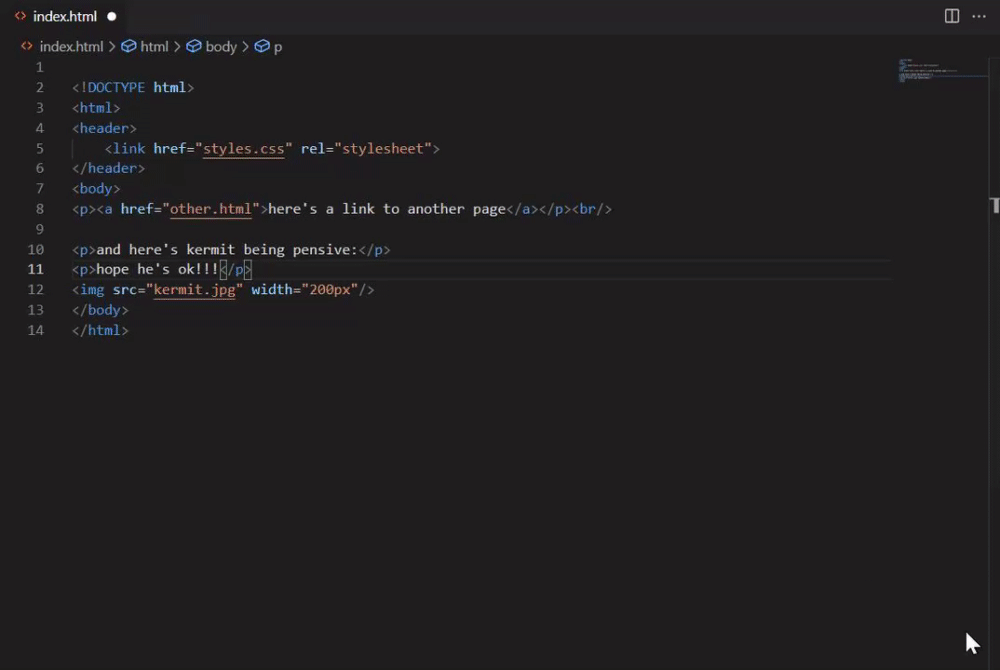
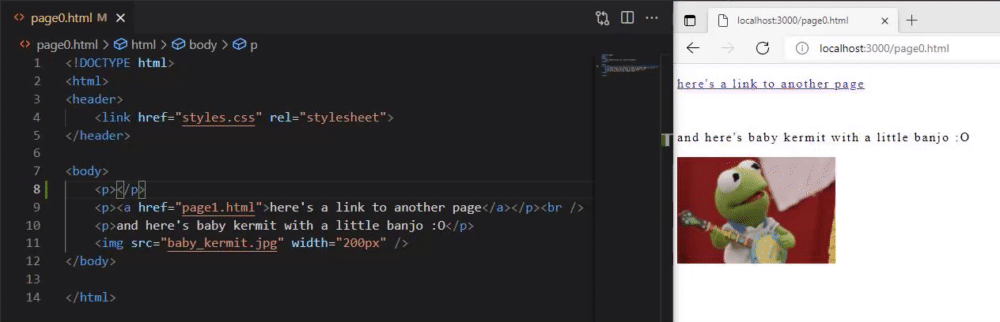
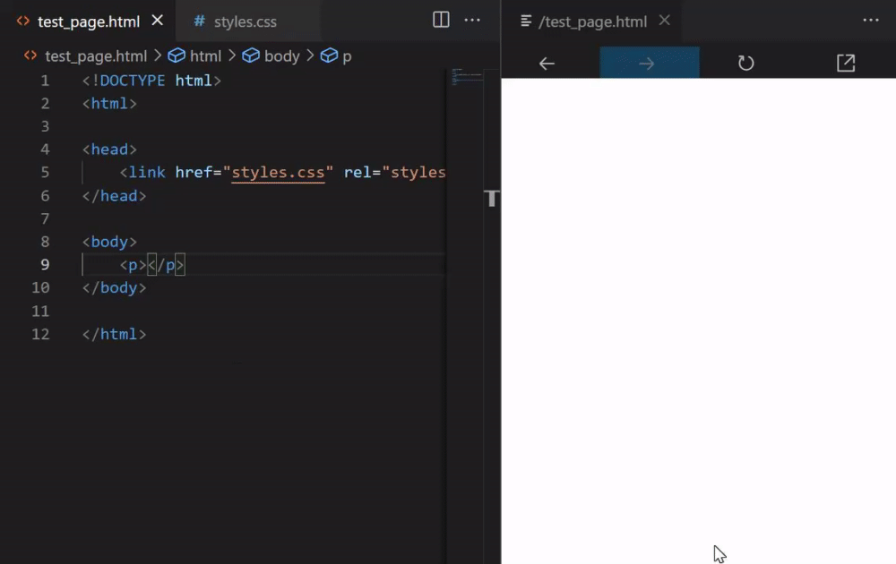
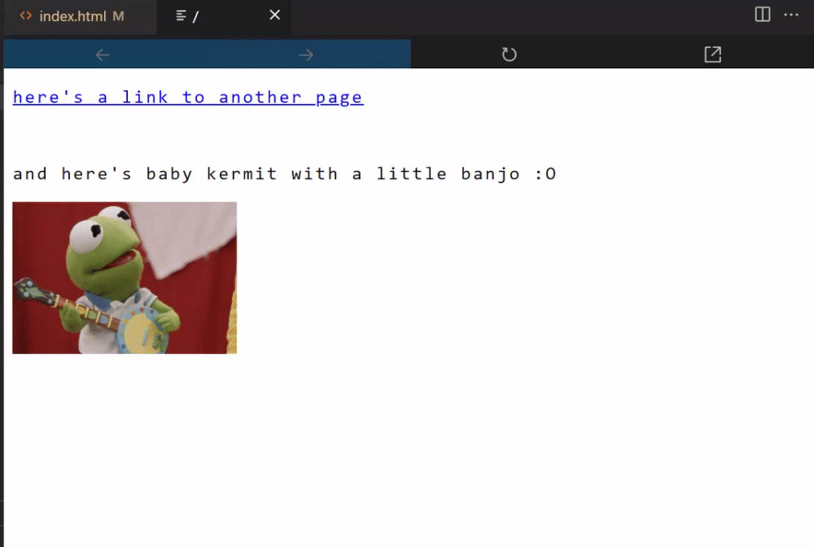
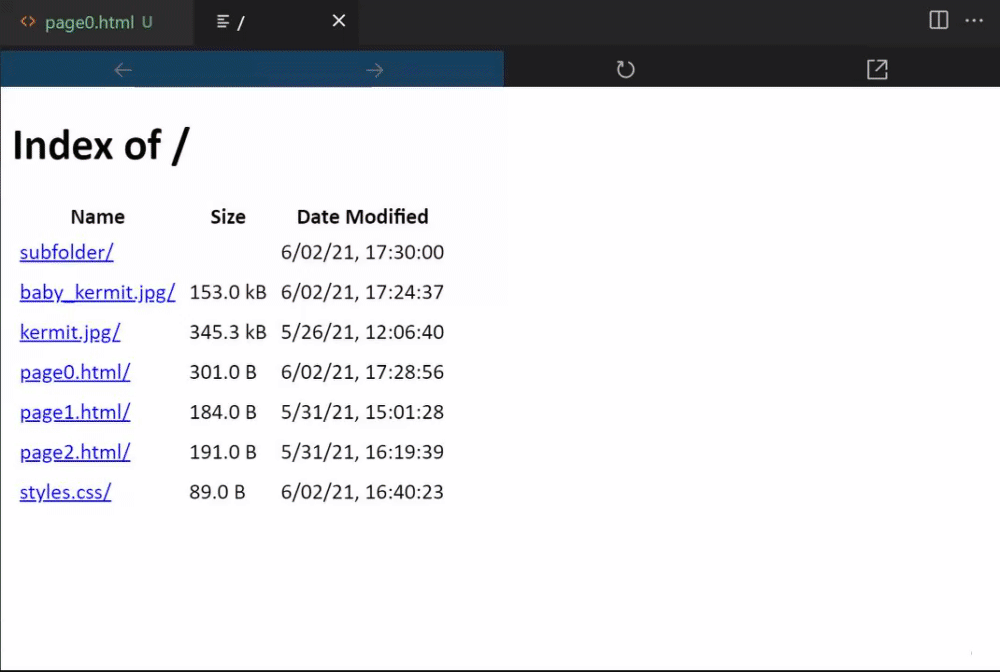

# May 2021 Release Notes - VS Code Live Server 📡💻

Although still in early development, the VS Code Live Server has seen some exciting initial features. Download the `.vsix` for it [here](https://github.com/andreamah/VS-Code-LiveServer-V2-Extension/releases/tag/0.1)!

## New Features

### 📣 Commands for Starting/Ending Port Hosting and Preview

Support for the following actions and associated commands (in the command palette):

| Action                                                                       | Command                                   |
| :--------------------------------------------------------------------------- | :---------------------------------------- |
| Starting the server on port 3000                                             | `LiveServer v2: Start Development Server` |
| Closing the server                                                           | `LiveServer v2: Close Development Server` |
| Viewing the embedded preview (does not require manually starting the server) | `LiveServer v2: Show Preview`             |

You can also host the server and interact with your code in your external browser once you start the server.

### 🚀 Live Reload (Previewing Unsaved Progress)

Unsaved progress within VS Code, in addition to file deletions/creations/renaming within the workspace, will appear in the preview.

### 👀 Embedded Preview

Includes:

- Buttons for `back`, `forward`, `refresh`, and `open in browser`.
- Current page tracking in the tab title.

### 🏠 Default Index Page and Associated Navigation.

This page shows if no `index.html` file is available for the directory that is currently opened in the editor (or if you have clicked on a link to a directory without an `index.html` file).

## Thanks for reading!

See the [June 2021 Iteration GitHub issue](https://github.com/microsoft/vscode/issues/124608) for some upcoming issues that may be tackled soon!

**Make sure to stay tuned for more progress! 🐸💡**
